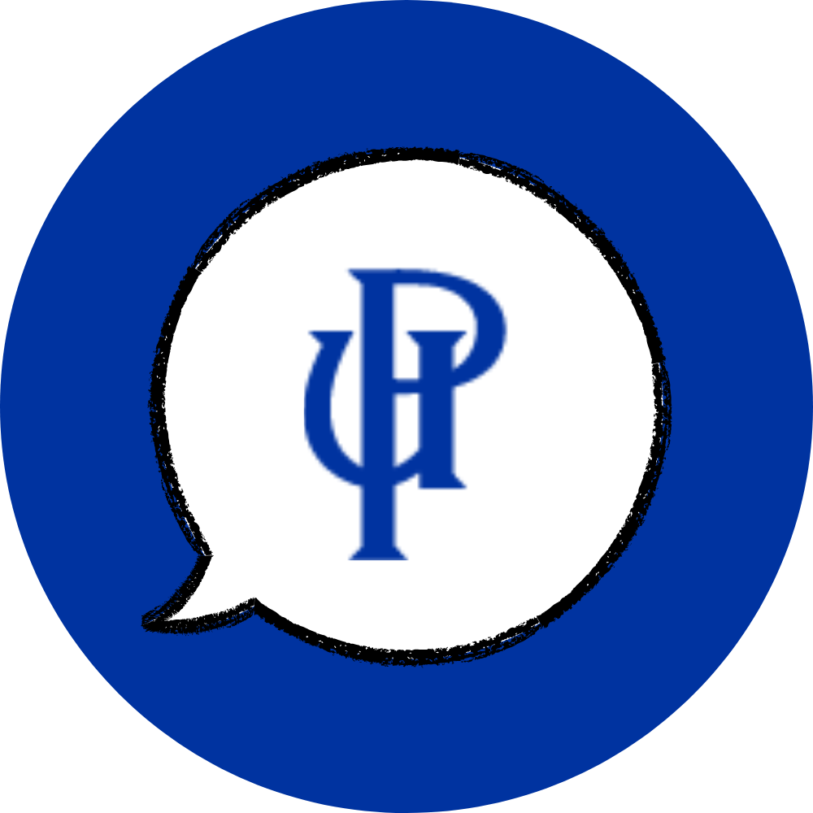

# Agente UP 

Un asistente virtual inteligente que ayuda a estudiantes de la Universidad del Pacífico a entender y acceder fácilmente a la información de reglamentos y documentos institucionales.

[English](#english) | [Español](#español)

---

### Desafío abordado
Crear un asistente virtual inteligente que ayude a estudiantes de la Universidad del Pacífico a entender y acceder fácilmente a la información de reglamentos y documentos institucionales.

### Recolección y enriquecimiento de datos
Procesamiento de documentos PDF institucionales (reglamentos, sílabos, SAR) mediante embeddings y vectorización semántica para búsqueda contextual inteligente.

### Modelo predictivo
Implementación de GPT-4 con memoria conversacional y búsqueda semántica en documentos vectorizados para proporcionar respuestas precisas y contextualizadas.

### Tecnologías utilizadas
- Python
- LangChain
- OpenAI
- ChromaDB
- Streamlit

### Características principales
- 🤖 Interfaz conversacional intuitiva
- 📚 Búsqueda semántica en documentos
- 💬 Memoria conversacional
- 📝 Citación automática de fuentes
- 🎓 Especializado en reglamentos UP

## 📝 License
Este proyecto está bajo la licencia MIT 

## 🤝 Contributing
Las contribuciones son bienvenidas.

---

Desarrollado con ❤️ para la Universidad del Pacífico

